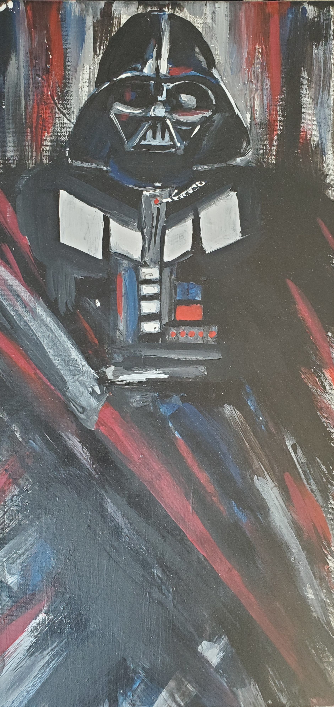
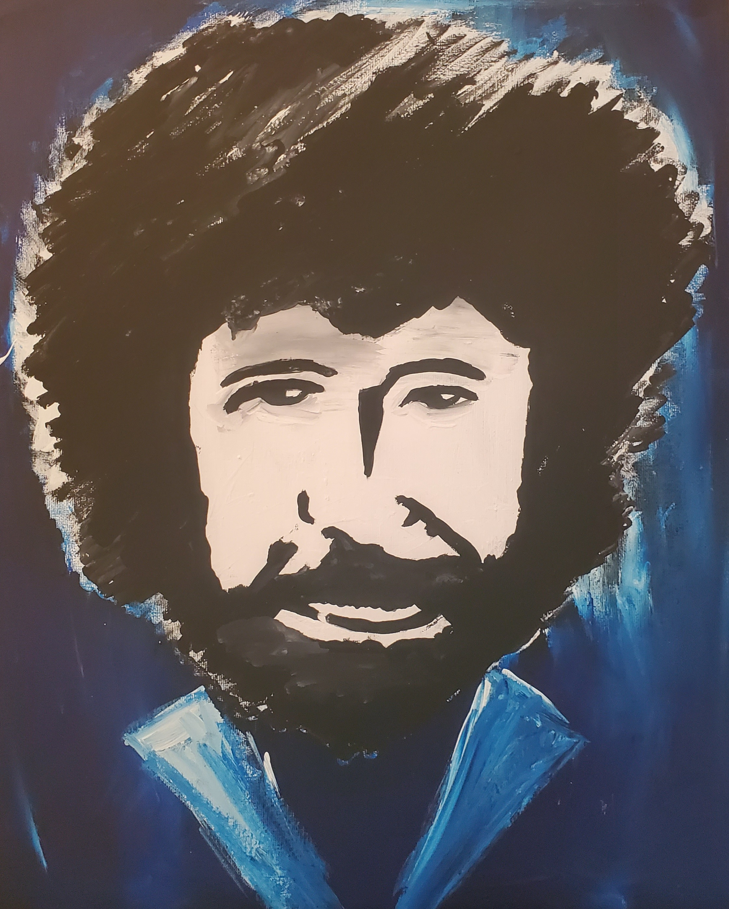
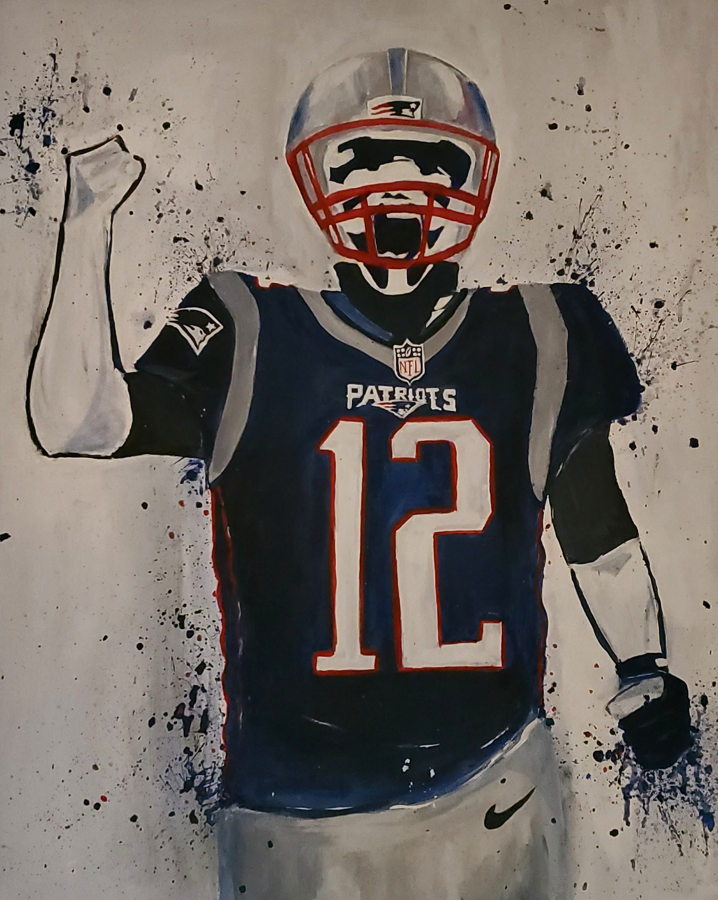
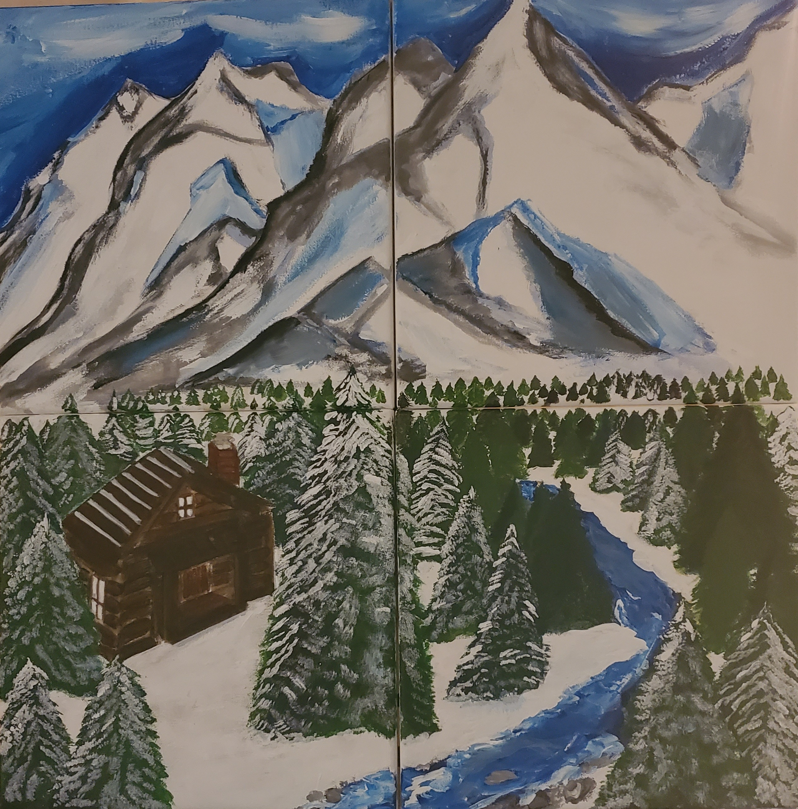
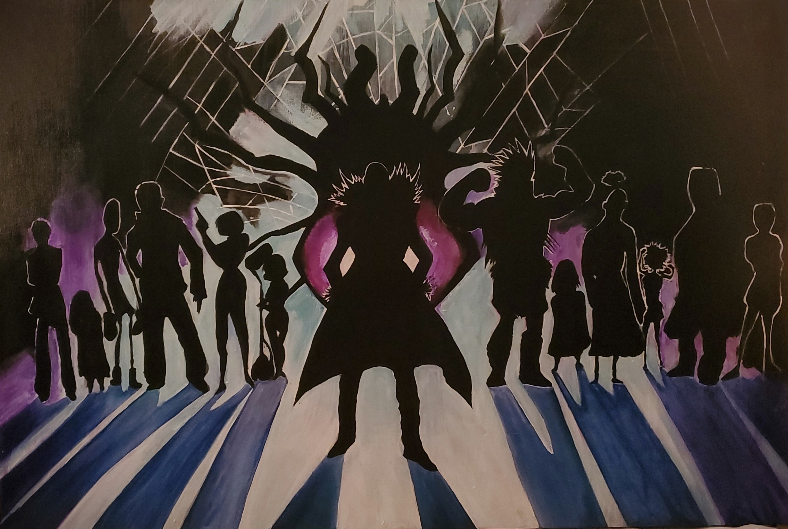

<link href="./markdown.css" rel="stylesheet">
<body>
  
<h1> Kinda Rocky Art </h1>

<h2> Welcome! </h2>

 Welcome to this portfolio! Below, you will find a little bit about me, and a few examples of my work! If you would like to contact me to request a commission, please refer to the commission agreement below. 
  
  <h1>Contact</h1>

For email quieries, contact mrachelle.rs@gmail.com.

  

  
The Art Commmission Agreement will need to be agreed upon before any work is started. The agreement is free to download from the link below. 

<aside>
  <h3> About Me </h3>

<picture>
  <source media="(min-width:650px)" srcset= "https://github.com/mswartze-creator/Student-Portfolio/blob/master/20200507_180422%20(1).jpg">
</picture>

 I'm Rachelle Swartzentruber, and I've loved to paint for as long as I can remember. I have presented at gallery events, most recently at Jirani Coffeehouse in Old Town Manassas, Virginia. An ongoing list of gallery showings will be present here, so please check back if interested. 

  </aside>

<h2>Artwork</h2>

  A few examples of my artwork are provided below!

<!-- Portfolio Gallery Grid -->

  <figure class="gallery__item gallery__item--1">
 
      <h3>Captain America</h3>
      
Captain America, Acrylic, 2017.

  </figure>
  <figure class="gallery__item gallery__item--2">
    
      <h3>Darth Vader</h3>
      
Darth Vader, Acrylic, 2017.

  </figure>
  <figure class="gallery__item gallery__item--3">
    
      <h3>Speed Paint</h3>
      
Bob Ross Speed Paint completed in 2.5 minutes during talent show! It currently resides on my friends' livingroom ceiling. 2020

  </figure>
  <figure class="gallery__item gallery__item--4">
    
      <h3>Tom Brady</h3>
      
Commissioned pop art portrait of Tom Brady, 2019

  </figure>
  <figure class="gallery__item gallery__item--5">
    
      <h3>Mountains</h3>
      
Commissioned four-part painting of the Alaskan Mountain Range, Acrylic, 2020

  </figure>
  <figure class="gallery__item gallery__item--6">
   
      <h3>Shadow Team</h3>
      
Commissioned 3 by 4 foot piece, Acrylic, 2019

  </figure>
    
    

<!-- END GRID -->

 
<footer> <h6> Copyright: George Mason University </h6> </footer>
